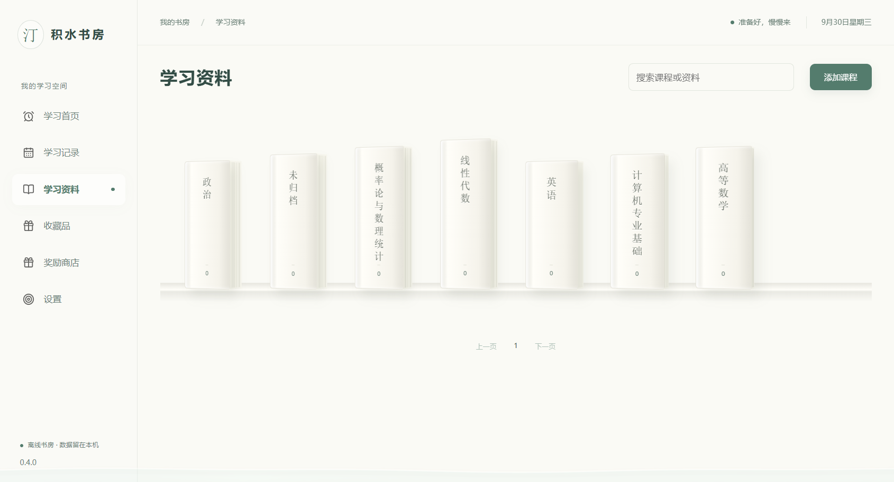
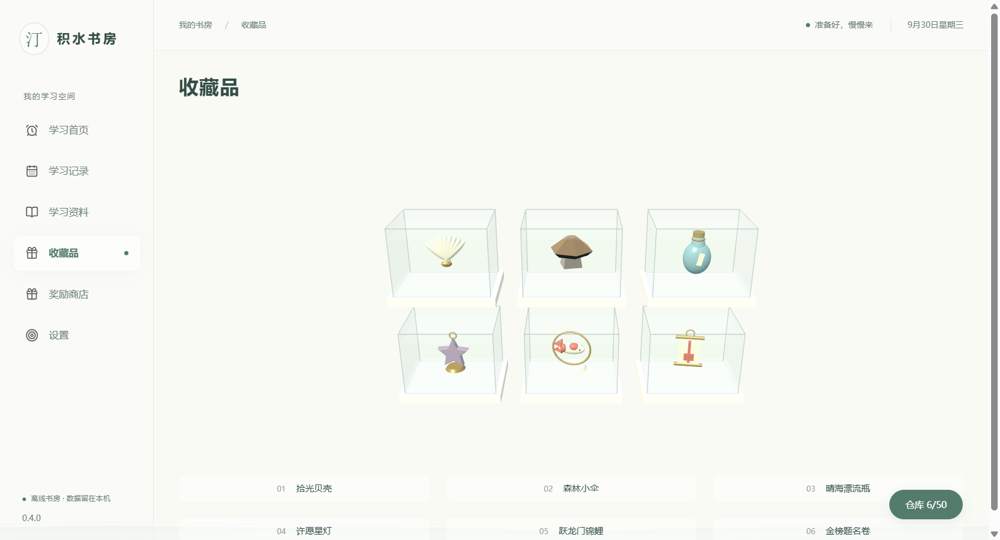

# 积水书房

一个离线 Windows 学习工作台，把有效学习时间、课程资料、随机小宝贝和积分奖励放在同一个书房里。使用 Electron、React、TypeScript、SQLite 与 Three.js；数据留在本机，运行无需账号或开发服务器。

[下载 Windows 正式版](https://github.com/1xiaoyueryuer/study-workbench/releases/latest) · [开发约束](agent.md) · [开发说明](docs/development.md) · [目录与接手指南](docs/project-map.md) · [验收与限制](docs/validation.md) · [素材来源](public/assets/SOURCES.md)



## 主要功能

- 素白立体课程书架；文件拖入、搜索、移动和重命名；相同内容只保存一份副本。
- 主进程记录有效学习时间；切页和最小化继续，暂停、锁屏和睡眠停止累计。
- 全局透明前景水，约每秒3–4滴；水位表现本次目标进度，雨滴不参与记账。
- 累计10–30分钟有效学习随机获得宝贝；50格仓库、六缸展示、交换与确认出售。
- 每60秒可用时间换1积分，奖励商店使用积分；累计学习时间不会减少。
- 完整备份恢复、真实旧版本迁移、缓存回收与空间统计。



12件宝贝随安装包离线提供。最高品质「跃龙门锦鲤」「金榜题名卷」分别寓意顺利上岸与金榜题名；采用浅色玻璃、自然小物和柔金属造型。

## 安装

从 [Releases](https://github.com/1xiaoyueryuer/study-workbench/releases) 下载 `StudyWorkbench-0.4.0-Setup.exe`，按向导安装。每次发行同时提供 `SHA256SUMS.txt`。完整NSIS x64包已包含Electron和SQLite原生件；当前安装包未签名。

默认数据目录为 `%APPDATA%/study-workbench`，安装目录与学习数据分开。卸载默认保留学习数据；定期在设置中导出 `.studybackup`。网页资料需要网络，Office文件需要本机已有对应应用。

## 开发

开始前必须先读 [agent.md](agent.md)。Windows x64、Node.js 24、npm 11；依赖由锁文件固定。主目录 `Projects/study-workbench` 只同步 GitHub main；实际修改与测试只在唯一 `Projects/study-workbench-dev` 工作树进行，一次一个完整功能分支。创建、中文提交、PR、合并与清理步骤见 [开发说明](docs/development.md)。

```powershell
npm ci
# 在唯一开发工作树设置隔离数据，避免读取真实学习库。
$env:STUDY_DATA_DIR = Join-Path $PWD ".artifacts/data/dev"
npm run dev
```

```powershell
npm run check     # 类型、静态检查、单元/集成、构建、Electron端到端
npm run dist:win  # 完整NSIS安装包
```

```text
AGENTS.md / agent.md  自动读取入口与统一开发约束
src/                  主进程、渲染页面与共享契约
tests/                单元、迁移、存储与Electron测试
scripts/              构建、素材生成和验收工具
public/               正式离线素材及许可证
build/                安装器品牌资源
docs/                 开发说明、历史设计、实测结论和代表截图
.github/workflows/    Windows持续集成
.artifacts/           本机构建/测试/缓存/安装输出，Git忽略
node_modules/         本机依赖，Git忽略
```

主目录保留已合并源码，开发工作树交付后移除内容并留下空目录，下一次从最新 main 重建。正式应用从安装后的桌面入口启动。目录职责、模块入口和后续会话的阅读顺序见 [接手指南](docs/project-map.md)。

## 验收与许可

0.4.0原始本机验收通过11项单元、25项集成/升级/存储和6项Electron端到端测试；已验证真实0.3.0安装升级及离线安装态流程。最终单独五分钟绘制p95为23ms。实测范围、并行负载下46ms结果和未验证的硬件/干净系统项目均在 [验收报告](docs/validation.md)。GitHub CI展示整理后源码的检查状态。

本项目源码公开，当前继续沿用 `UNLICENSED`、保留版权的许可状态。第三方组件和素材遵守各自许可证，见 [THIRD_PARTY_NOTICES.txt](THIRD_PARTY_NOTICES.txt) 与 `public/assets`；Kenney模型为CC0，其余收藏模型为项目原创。
